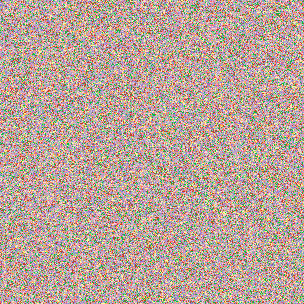

# Open art!

A painting you can contribute to by sending in pull requests.
This repo serves two purposes: having some fun and second,
learn people that are new to git(hub) how a pull request works

## Result so far



## Rules

- Be nice :)
- Make the canvas collaboration friendly

## Some inspiration

- Make a script that adds a smiley to the canvas
- ..
- ..

## Contribute

There are two ways to contribute, update some pixels or update Rembrandt.

### Update some pixels

#### First time contributor

1. First you have to fork this repo

2. Now clone this repo to your computer
```
git clone git@github.com/<your-github-username>/open-art
```
Replace `<your-github-username>` with your github username ;)

3. Now you have to make a topic branch.
```
git checkout -b <your-topic-branch-name>
```
For example
```
git checkout -b the-night-watch
```
Now you should see:
```
Switched to a new branch 'the-night-watch'
```

4. Ok, now it's time to update some pixels. In the `canvas` folder you will find
all the pixels with their colors.

5. todo: run rembrandt to see the result
```
ruby rembrandt.rb
```
See the results by opening `painting.gif`
```
open painting.gif
```

6. todo: commit
```
git commit -a -m 'Look at the pixels I changed'
```

7. todo: push
```
git push origin the-night-watch
```

8. todo: pull request

9. wait..

10. Yeyyy! PR accepted! and the painting is updated!

#### If you have send a open-art pull request before

Todo: Tell something about syncing the fork with the original

### Update Rembrandt
Rembrandt is a small script rendering the canvas.
I didn't spend any time optimising it,
also I'm not sure if I've chosen the most efficient grid system.
